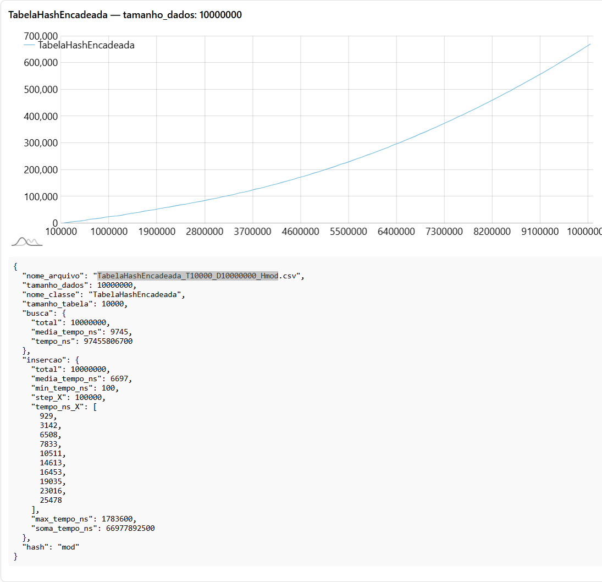

# Tabelas Hash - Relatório de Performance
Este projeto analisa o desempenho de diferentes implementações de tabelas hash, explorando como o tamanho da tabela (**T**) e a quantidade de dados (**D**) afetam o número de colisões e o tempo de inserção.

## 🧪 Como Executar (Caso queira)

Para compilar e executar o projeto:

```bash
mvn native:compile exec:java
```

## 🧩 Parâmetros Importantes

* **T** – Tamanho da tabela hash.
* **D** – Quantidade total de dados inseridos.
* **H** – Função hash (*mod*, *mult*, *fold*).
* **EncadeadaCheatada** – Insere no final da lista sem a percorrer, mas contabiliza colisões.

## 🛠️ Implementações Testadas

* **Hash com Rehashing**: Reaplica função hash em caso de colisão e duplica o tamanho quando cheia.
* **Hash Encadeada**: Lista encadeada em cada posição da tabela.
* **Hash Encadeada Cheatada**: Versão otimizada que insere direto no fim.
* **Hash com Árvore Binária**: Cada posição é uma árvore balanceada.


## 📊 Resultados
### [GoogleDrive com todos os CVS do resultado](https://drive.google.com/drive/folders/1NEXZyDGQvuuR-P9y6GpbJfn5vmW5pshe?usp=drive_link)

### [Graficos](https://leolguedes.github.io/tabela_HASH/)

## 📊 Comparando os Resultados


Maquina que foi usada para os testes:

```
                                ..,   Nina@DESKTOP-7FHLKK2
                    ....,,:;+ccllll   --------------------
      ...,,+:;  cllllllllllllllllll   OS: Windows 10 Home Single Language x86_6
,cclllllllllll  lllllllllllllllllll   Host: Gigabyte Technology Co., Ltd. A320M
llllllllllllll  lllllllllllllllllll   Kernel: 10.0.19045
llllllllllllll  lllllllllllllllllll   Uptime: 19 hours, 19 mins
llllllllllllll  lllllllllllllllllll   Packages: 2 (scoop)
llllllllllllll  lllllllllllllllllll   Shell: bash 5.2.37
llllllllllllll  lllllllllllllllllll   Resolution: 1920x1080
                                      DE: Aero
llllllllllllll  lllllllllllllllllll   Terminal: mintty
llllllllllllll  lllllllllllllllllll   CPU: AMD Ryzen 5 1600 (12) @ 3.200GHz
llllllllllllll  lllllllllllllllllll   GPU: Caption
llllllllllllll  lllllllllllllllllll   GPU: NVIDIA GeForce GTX 1070 Ti
llllllllllllll  lllllllllllllllllll   GPU
`'ccllllllllll  lllllllllllllllllll   Memory: 5913MiB / 8140MiB
       `' \*::  :ccllllllllllllllll
                       ````''*::cll
                                 ``
```

A seguir, gráficos organizados para comparação direta entre as implementações **com o mesmo T e D**.

### 1) Para T1_000 e D100_000

#### **Ranking de Desempenho (velocidade):**
#### Inserção

| Posição | Velocidade(s) | TabelaHash |
|---------|---------------|------------|
| `1º`    |               |            |
| `2º`    |               |            |
| `3º`    |               |            |
| `4º`    |               |            |

#### Busca:

| Posição | Velocidade(s) | TabelaHash |
|---------|---------------|------------|
| `1º`    |               |            |
| `2º`    |               |            |
| `3º`    |               |            |
| `4º`    |               |            |

> Nesta comparação, a tabela hash com encadeamento simples (Encadeada) 
> obteve o melhor desempenho, mesmo com um número significativo de colisões. 
> Isso ocorre porque, ao usar listas ligadas para armazenar elementos com o 
> mesmo valor de hash, o tempo de inserção permanece constante, independentemente 
> do número de colisões.
> As outras implementações, que incluem verificações adicionais de colisões e 
> ajustes no tamanho da tabela, apresentaram um desempenho inferior. 
> Embora essas técnicas possam reduzir o número de colisões, elas introduzem 
> complexidade adicional e, em alguns casos, aumentam o tempo de inserção devido 
> a operações extras necessárias para gerenciar as colisões.
> Portanto, para cenários com uma grande quantidade de dados e tabelas de tamanho 
> fixo, a abordagem de encadeamento simples se mostrou mais eficiente em termos 
> de tempo de inserção.


### 2) Para T1_000 e D1_000_000
#### Inserção

| Posição | Velocidade(s) | TabelaHash |
|---------|---------------|------------|
| `1º`    |               |            |
| `2º`    |               |            |
| `3º`    |               |            |
| `4º`    |               |            |

#### Busca:

| Posição | Velocidade(s) | TabelaHash |
|---------|---------------|------------|
| `1º`    |               |            |
| `2º`    |               |            |
| `3º`    |               |            |
| `4º`    |               |            |


### 3) Para T1_000 e D10_000_000
#### Inserção

| Posição | Velocidade(s) | TabelaHash |
|---------|---------------|------------|
| `1º`    |               |            |
| `2º`    |               |            |
| `3º`    |               |            |
| `4º`    |               |            |

#### Busca:

| Posição | Velocidade(s) | TabelaHash |
|---------|---------------|------------|
| `1º`    |               |            |
| `2º`    |               |            |
| `3º`    |               |            |
| `4º`    |               |            |


### 4) Para T10_000 e D100_000
#### Inserção

| Posição | Velocidade(s) | TabelaHash |
|---------|---------------|------------|
| `1º`    |               |            |
| `2º`    |               |            |
| `3º`    |               |            |
| `4º`    |               |            |

#### Busca:

| Posição | Velocidade(s) | TabelaHash |
|---------|---------------|------------|
| `1º`    |               |            |
| `2º`    |               |            |
| `3º`    |               |            |
| `4º`    |               |            |


### 5) Para T10_000 e D1_000_000
#### Inserção

| Posição | Velocidade(s) | TabelaHash |
|---------|---------------|------------|
| `1º`    |               |            |
| `2º`    |               |            |
| `3º`    |               |            |
| `4º`    |               |            |

#### Busca:

| Posição | Velocidade(s) | TabelaHash |
|---------|---------------|------------|
| `1º`    |               |            |
| `2º`    |               |            |
| `3º`    |               |            |
| `4º`    |               |            |


### 6) Para T10_000 e D10_000_000
#### Inserção

| Posição | Velocidade(s) | TabelaHash |
|---------|---------------|------------|
| `1º`    |               |            |
| `2º`    |               |            |
| `3º`    |               |            |
| `4º`    |               |            |

#### Busca:

| Posição | Velocidade(s) | TabelaHash |
|---------|---------------|------------|
| `1º`    |               |            |
| `2º`    |               |            |
| `3º`    |               |            |
| `4º`    |               |            |





### 7) Para T100_000 e D100_000
#### Inserção

| Posição | Velocidade(s) | TabelaHash |
|---------|---------------|------------|
| `1º`    |               |            |
| `2º`    |               |            |
| `3º`    |               |            |
| `4º`    |               |            |

#### Busca:

| Posição | Velocidade(s) | TabelaHash |
|---------|---------------|------------|
| `1º`    |               |            |
| `2º`    |               |            |
| `3º`    |               |            |
| `4º`    |               |            |


### 8) Para T100_000 e D1_000_000
#### Inserção

| Posição | Velocidade(s) | TabelaHash |
|---------|---------------|------------|
| `1º`    |               |            |
| `2º`    |               |            |
| `3º`    |               |            |
| `4º`    |               |            |

#### Busca:

| Posição | Velocidade(s) | TabelaHash |
|---------|---------------|------------|
| `1º`    |               |            |
| `2º`    |               |            |
| `3º`    |               |            |
| `4º`    |               |            |


### 9) Para T100_000 e D10_000_000
#### Inserção

| Posição | Velocidade(s) | TabelaHash |
|---------|---------------|------------|
| `1º`    |               |            |
| `2º`    |               |            |
| `3º`    |               |            |
| `4º`    |               |            |

#### Busca:

| Posição | Velocidade(s) | TabelaHash |
|---------|---------------|------------|
| `1º`    |               |            |
| `2º`    |               |            |
| `3º`    |               |            |
| `4º`    |               |            |


### Coisas a fazer:
2. Escolha três variações da função hash, por exemplo: resto da divisão, multiplicação. (pesquisar e escolher a que achar melhor) (para rehashing sugere-se hash duplo e hash linear/quadrático por exemplo).
3. Encontre as 3 maiores listas encadeadas geradas.
4. Encontre as 3 maiores arvores binarias geradas.
5. Encontre os o menor gap o maior e a média de gap entre elementos no vetor.( gap = espaço )
